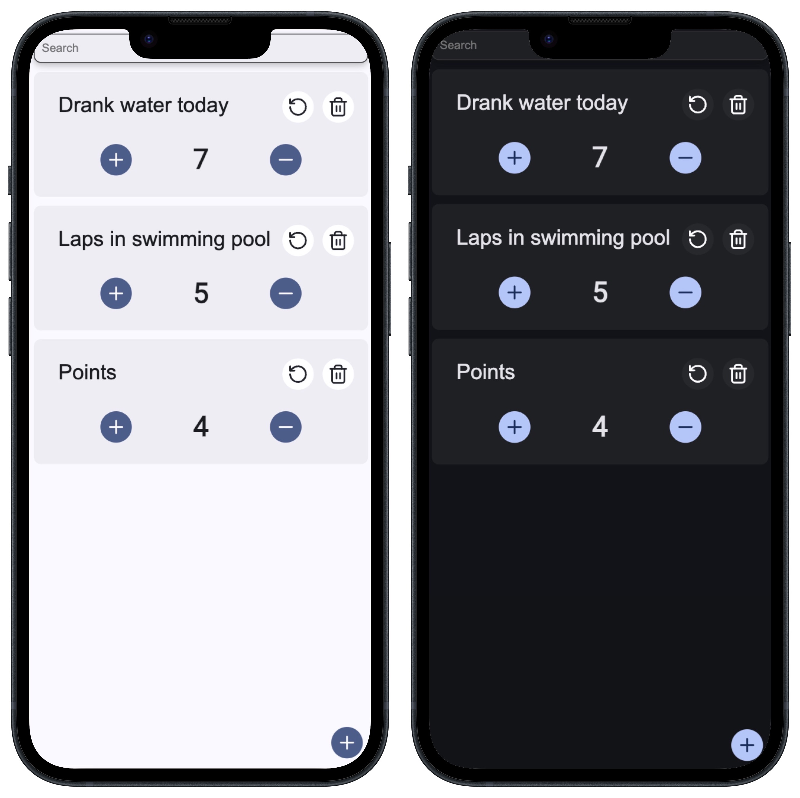

# Plain Counter

A simple React application to **keep track of things** with persistent data storage in `localStorage`. This app allows
users to add, increase, decrease, rename, reset, and delete counters in an intuitive and easy-to-use interface. The app
is **mobile-first**, optimized for smaller screens and responsive on larger devices.

## Features

-   **Add counters**: Easily create new counters with custom names.
-   **Increase/decrease counters**: Adjust counter values with buttons.
-   **Rename counters**: Change the name of any counter.
-   **Reset counters**: Set a counter’s value back to 0.
-   **Delete counters**: Remove counters from the list when they are no longer needed.
-   **Search functionality**: Quickly find counters by name.

## Screenshots

## Technologies Used

-   **React**: For building the user interface.
-   **CSS**: For styling the application.
-   **TypeScript**: For type safety and better development experience.

Made with:

## Usage

-   Click the plus button to create a new counter.
-   Type the counter name and press Enter to save it.
-   Use the plus and minus buttons to increase or decrease the counter value.
-   Click the reset button to reset the counter to zero.
-   Click the trash icon to delete the counter from the list.
-   Use the search bar to find counters by their names.

## License

This project is licensed under the MIT License - see the LICENSE file for details.
